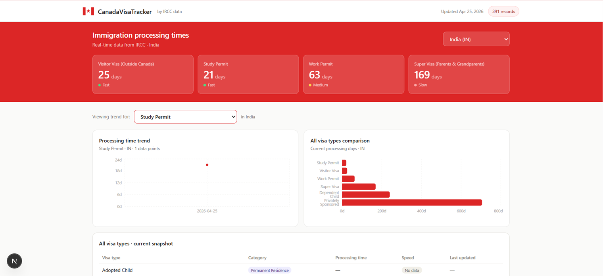

# CanadaVisaTracker

A full-stack web application that tracks Canadian immigration processing times from IRCC (Immigration, Refugees and Citizenship Canada) and visualizes historical trends.

## The Problem

IRCC publishes current processing times but provides no historical data. Applicants have no way to know if times are improving or getting worse. This app solves that by scraping IRCC daily and building a historical dataset over time.

## Live Demo

> Coming soon — deployment in progress

## Features

- Real-time processing times for 8 visa categories across 190+ countries
- Historical trend charts showing how processing times change over time
- Country and visa type filters
- Color-coded speed indicators (fast / medium / slow)
- Automated daily scraping pipeline
- REST API with 6 endpoints

## Tech Stack

**Backend**
- Python 3.13
- Django 5 + Django REST Framework
- PostgreSQL 18
- python-dotenv for environment management

**Frontend**
- Next.js (React)
- Recharts for data visualization
- Tailwind CSS

**Data Pipeline**
- IRCC public JSON API as data source
- Custom ETL pipeline (fetch → parse → save)
- Celery + Redis for scheduled daily scraping (coming soon)

**DevOps**
- Git + GitHub
- AWS deployment (coming soon)

## Architecture